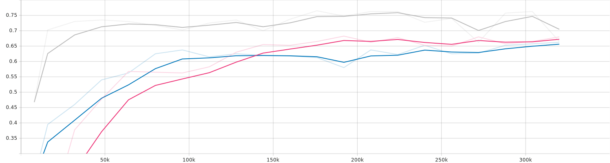
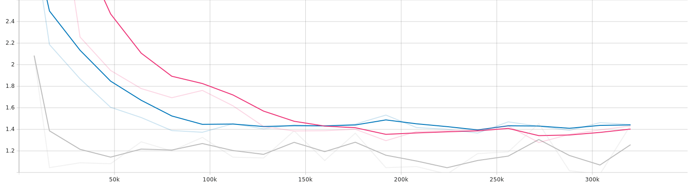

[Japanese/[English](README_EN.md)]

# Audio-Recognition-ESC50
Pytorchの畳み込みモデルを用いて録音んデータを画像として認識を行う。録音データは数が少ないからデータ拡張を用いて新しいデータを作ります。
このプロジェクトの環境音の分類を認識する目的として畳み込みニューラルネットワークを使ります。

## Requirements
pytorch==2.0.1
pytorch-cuda==11.8
torchvision==0.15.2
torchaudio==2.0.2
matplotlib==3.8.0
numpy==1.25.2
pandas==2.0.3

## Dataset
https://github.com/karolpiczak/ESC-50
環境音の分類は録音データの種類を決めるために。このデータセットはESC50という名前。これは50の種類の録音があります。
色々な種類があるけど録音データがあんまりないから後でデータ拡張します。2000サンプル数は2000と５数の分割がある、
分割一つは400数のサンプルを持ちます。

### データ拡張
スペクトログラムでーたを拡張する時、普通の技術は全部使えない、例えば回るとかフリップするとかは時間の順を崩すのでつかえない。
他の選択肢は録音の形で拡張するけどそれは資源や時間が問題になる。だから一番現実的な方法は録音データをスペクトログラムを変えて、
その形でクロップすると画像の一部分をマスクする。その拡張方法を使って最初の1600サンプル数は8000数にすることが出来ます。
この技術を使って過学習の問題を大幅に解決出来ましたと思う。

## Model description
色々のモデルを試したけど一番精度が高い三つのモデルは

    -Resnet18。
    -8層の畳み込みmaxpoolを使えない,avgpoolだけを使う、Resnet18のように。
    -4層の畳み込みモデルmaxpool使ってる。

## File description
    -dsets.py　データセットを作るモジュール。
    -training.py マインファイルである。学習を実践する。
    -model.py　全部のモデルは含まれている。

## Training
dsets.pyのパスを変えて、自分が持てるデータセットを決定する。その後tensorboardのコメントを自分の好みに変わって。ターミナルで
python -m training.py を実行すると学習が始まります。
### Parameter
実行時には、以下のオプションが指定可能です。

    --batch-size はバッチの数である。これはGPUのメモリーを使う。
    --epochs エポックは全文のデータを使って学習をする、そのループの何回はエポック。40回くらいは十分、このモデルの場合。
    --tb-prefix 　tensoboardプレフィックス、結果を分析する時使う。
    comment　tensoboardコメント、結果を分析する時使う。

## Evaluation Metrics
精度の高さを図るために、エポックずつバッチのloss, accuracy, precision, recall と f1-scoreが平均する、バッチ数を使って。
でも一番良いモデルを保存されるのは一番低いlossを持つエポック。

## Results
この結果は40エポックを使った、40分くらいかかった。灰色のラインはResnet18のモデル、ピンクのラインは8層の畳み込みモデルと最後に青いラインは
4層の畳み込みモデル。

この三つのグラフは精度、F1scoreとloss、その順番であります。
### 精度

### F1 Score

### Loss

## Author
[fuwafuwamoemoekissaten](https://github.com/fuwafuwamoemoekissaten)

## References
https://qiita.com/m__k/items/0673dedadc4c0546a58e

https://github.com/karolpiczak/ESC-50

https://blog.research.google/2019/04/specaugment-new-data-augmentation.html?m=1

Stevens, E., Antiga, L., Viehmann, T., &amp; Chintala, S. (2020).
Deep learning with pytorch: Build, train, and tune neural networks using python tools. Manning Publications.

## LICENSE
このプロジェクトはMITライセンスの下でライセンスされています。詳細については[LICENSE.md](LICENSE)ファイルを参照してください。
