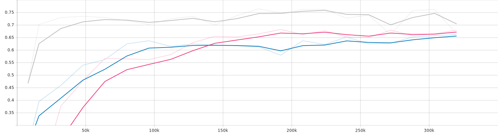

[[Japanese](README.md)/English]
# Audio-Recognition-ESC50
The objective of this project is to classify environmental sounds, using Convolutional Neural Networks(CNN). 
Audio datasets have a limited number of samples, so data augmentation seemed to be a good aproach to solve that
issue. To apply the CNNs, the audio data is transformed to a spectrogram so that it is like an image.

## Requirements
pytorch==2.0.1
pytorch-cuda==11.8
torchvision==0.15.2
torchaudio==2.0.2
matplotlib==3.8.0
numpy==1.25.2
pandas==2.0.3

## Dataset
https://github.com/karolpiczak/ESC-50

The dataset consists of 2000 samples of environmental sounds, there are 50 classes. The dataset is divided in 5 folds 
which will be helpful for the splitting of the data. The classes range from animals sounds to urban noises.

### Data agumentation
In the form of a spectrogram, normal image transformations can be used but there are some of them that produce bad 
transformations. For example, it is not usefull to apply a flip transformation, because the X axis is the time, so the 
time would be inverted. In the end, the used transformations were random crop and time-frequency mask. The initial 
dimensions are 128x431, after the crop it turns to 100x384. And the mask is just deleting some parts, straights lines, 
of the image.

Using data augmentation, we can go from 1600 training sample size to 8000 without generating not representative data, 
this prevents overfitting and makes the model more robust, but it may produce a decrease of the accuracy.

## Model description
After testing several architectures, the most promising models were

    -Resnet18。
    -A 8 layer depth model using stride 2 in the convolutions instead of maxpooling, and using avgpool for the last layers, like the resnet architecture does.
    -A 4 layer depth model that uses maxpool to decrease dimensions instead of adding stride in the convolutions.

## File description
    -dsets.py　Module that creates the datasets.
    -training.py Main file that has the training loop and the metrics.
    -model.py Module that stores the different models

## Training
To train the model, change the path in the dsets.py to the folder with the data. Then change the tensorboard directory
to your desired location. To finish, run python -m training in your terminal, opened in the directory where you have
the files, and the training should start.
### Parameter
When using the model, there are several options that can be changed.

    --batch-size Number of samples per batch, it uses the memory of the GPU.
    --epochs Epochs are the number of times to repeat the learning loop. The results were achieved using 40 epochs for training.
    --tb-prefix It changes the prefix of the tensorboard files, used when analyzing the model.
    comment　The comment of the tensorboard, used when analyzing the model.

## Evaluation Metrics
To measure the performance of the models, in each epoch, it computes the mean of the batch loss, accuracy, precision,
recall and f1-score, using the number of batches to compute the mean. When saving the best model, only metric used was 
the loss of the validation set.

## Results
The results were achieved using 40 epochs as parameters, with took approximately 40 minutes. The gray line is the 
Resnet18 model, the pink line is the 8 depth layer CNN. Finally, the blue line is the 4 depth layer CNN.

This 3 graphs are accuracy, F1-score and loss, respectively.
### Accuracy

### F1 Score

### Loss

## Author
[fuwafuwamoemoekissaten](https://github.com/fuwafuwamoemoekissaten)

## References
https://qiita.com/m__k/items/0673dedadc4c0546a58e

https://github.com/karolpiczak/ESC-50

https://blog.research.google/2019/04/specaugment-new-data-augmentation.html?m=1

Stevens, E., Antiga, L., Viehmann, T., &amp; Chintala, S. (2020).
Deep learning with pytorch: Build, train, and tune neural networks using python tools. Manning Publications.

## LICENSE
This project is licensed under the MIT license. Details are in the [LICENSE.md](LICENSE) file.